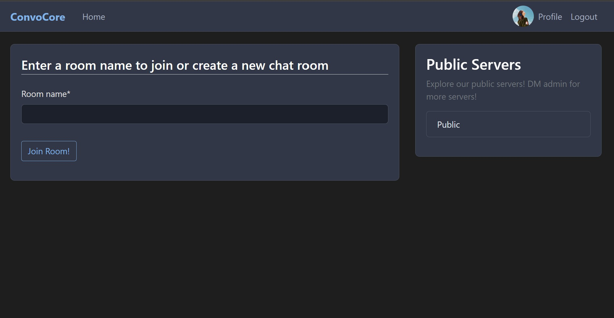

# ConvoCore 💬

A real-time chat application built with Django and WebSockets for seamless communication.

## Overview

ConvoCore is a modern chat application that demonstrates distributed systems concepts through real-time messaging. Users can create chat rooms, send instant messages, and manage their profiles in a sleek dark-themed interface.

## 🛠️ Tech Stack

- **Backend:** Django, Django Channels, WebSockets
- **Frontend:** HTML5, CSS3, JavaScript, Bootstrap
- **Database:** SQLite
- **Real-time:** WebSocket connections
- **Authentication:** Django built-in auth
  
## ✨ Features

- 🚀 Real-time messaging with WebSocket technology
- 👥 Dynamic chat room creation and joining
- 🔐 User authentication and profile management
- 📱 Responsive dark theme design
- 💬 Persistent chat history
- 🌐 Public room discovery

## Setup
### Installation

1. **Clone the repository**
   ```bash
   git clone https://github.com/yourusername/convocore-realtime-chat.git
   cd convocore-realtime-chat
   ```

2. **Create virtual environment**
   ```bash
   python -m venv convocore_env
   # Windows:
   convocore_env\Scripts\activate
   # macOS/Linux:
   source convocore_env/bin/activate
   ```

3. **Install dependencies**
   ```bash
   pip install -r requirements.txt
   ```

4. **Setup environment variables**
   ```bash
   # Create .env file and add:
   SECRET_KEY=your-secret-key-here
   DEBUG=True
   ```

5. **Setup database**
   ```bash
   python manage.py migrate
   ```

6. **Run the application**
   ```bash
   python manage.py runserver
   ```

7. **Visit** `http://127.0.0.1:8000` and start chatting!

## Screenshots

### Home Page


### Chat Interface


### Public Server


### Interaction


---

Built with ❤️ using Django and WebSockets
